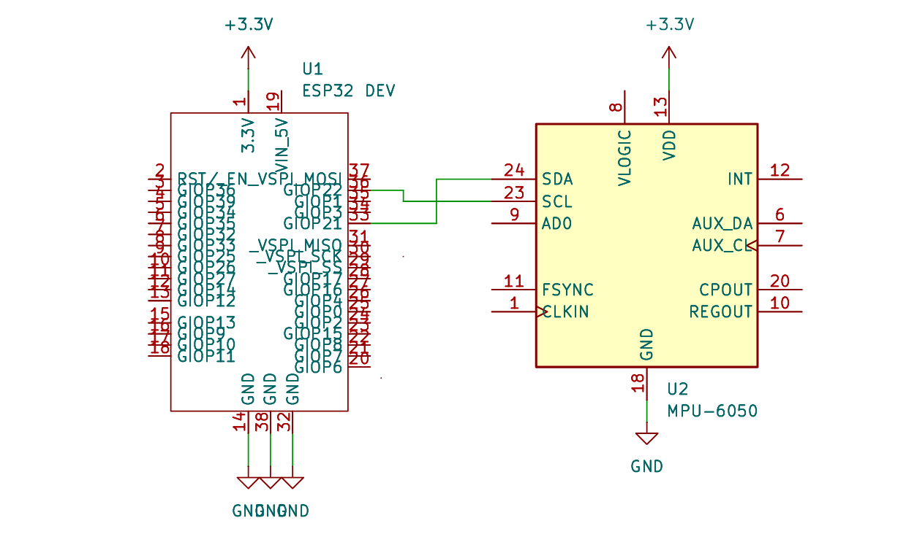

# Your Project Name
  'Air Mouse'

# Full name
  Melnicu Raluca-Maria

## Description
  Souris aérienne utilisant un capteur MPU6050 et un ESP32. Le MPU6050 suit les mouvements de la main en temps réel, tandis que l'ESP32 traite les données et les     transmet via Bluetooth facilitant ainsi le contrôle de divers appareils. Je vais faire une démonstration de l'utilisation de la souris avec Processing 3.

## Motivation
  Adapter une souris normale d'une manière qui aider les personnes handicapées ou simplement utiliser une souris d'une nouvelle façon.

## Architecture

### Block diagram

<!-- Make sure the path to the picture is correct -->

### Schematic

### Components

| Device | Usage | Price |
|--------|--------|-------|
| Perfboard | Perfboard | [3 RON](https://www.optimusdigital.ro/ro/prototipare-cablaje-de-test/232-cablaj-de-test.html) |
| ESP32 board| Microcontroller | [30 RON](https://www.optimusdigital.ro/ro/placi-cu-esp32/12933-placa-de-dezvoltare-plusivo-wireless-compatibila-cu-esp32-si-ble.html) |
| MPU6050 | détection des mouvements | [14.70 RON](https://www.optimusdigital.ro/ro/senzori-senzori-inertiali/13611-modul-accelerometru-i-giroscop-cu-3-axe-mpu6050-cu-pini-lipiti.html) |
| Résistance | résistance | [0.10 RON](https://www.optimusdigital.ro/ro/componente-electronice-rezistoare/1859-rezistor-025w-56k.html) |
| Slider switch | ouverture/fermeture du circuit | [0.50 RON](https://ardushop.ro/ro/butoane--switch-uri/803-slider-switch-2-pozitii-6427854010391.html) |
| LiPo battery 3.7V | alimenter le circuit | [33 RON](https://www.emag.ro/acumulator-litiu-polimer-120mah-3-7v-liter-energy-battery-model-401230-420/pd/DW1RWVYBM/?utm_campaign=share_product&utm_source=mobile_dynamic_share&utm_medium=android) |
| Micro USB | connexion | [40 RON]() |

### Libraries

<!-- This is just an example, fill in the table with your actual components -->

| Library | Description | Usage |
|---------|-------------|-------|
| [Arduino.h](https://github.com/arduino/ArduinoCore-avr/blob/master/cores/arduino/Arduino.h) |  Main include file for the Arduino SDK | Pour fonctions de base d'Arduino |
| [Wire.h](https://github.com/arduino/ArduinoCore-avr/blob/master/libraries/Wire/src/Wire.h) | TWI/I2C library for Arduino & Wiring | Communication I2C-utilisée pour communiquer avec le capteur MPU6050 |
| [Adafruit_MPU6050.h]([(https://github.com/adafruit/Adafruit_MPU6050)) |  Bibliothèque Arduino pour accéléromètre et gyroscope Adafruit MPU6050 à 6-DoF | Bibliothèque pour  MPU6050 |
| [Adafruit_Sensor.h](https://github.com/adafruit/adafruit_sensor) |  Tout pilote prenant en charge la couche d'abstraction unifiée des capteurs Adafruit implémentera la classe de base Adafruit_Sensor | Cadre de capteurs Adafruit partagé |
| [BleMouse.h](https://github.com/T-vK/ESP32-BLE-Mouse) |  Cette bibliothèque vous permet de faire fonctionner l'ESP32 comme une souris Bluetooth et de contrôler ses actions : déplacer la souris, faire défiler, cliquer, etc | Permet à l'ESP32 de se comporter comme une souris Bluetooth |

## Log

<!-- write every week your progress here -->

### Week 6 - 12 May

### Week 7 - 19 May

### Week 20 - 26 May

## Reference links

<!-- Fill in with appropriate links and link titles -->

[Tutorial 1](https://www.youtube.com/watch?v=wdgULBpRoXk&t=1s&ab_channel=BenEater)

[Article 1](https://www.explainthatstuff.com/induction-motors.html)

[Link title](https://projecthub.arduino.cc/)
